# WildRift Dictionary
# 와일드 리프트 백과사전
https://play.google.com/store/apps/details?id=com.taetae98.wildriftdictionary

## 😊 Introduction
* #### NoticeFragment
* #### 공지사항을 확인할 수 있습니다.
* #### You can check the announcement.
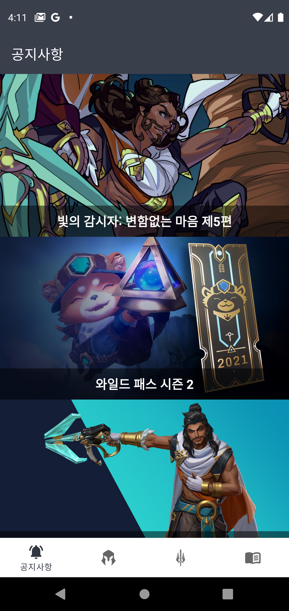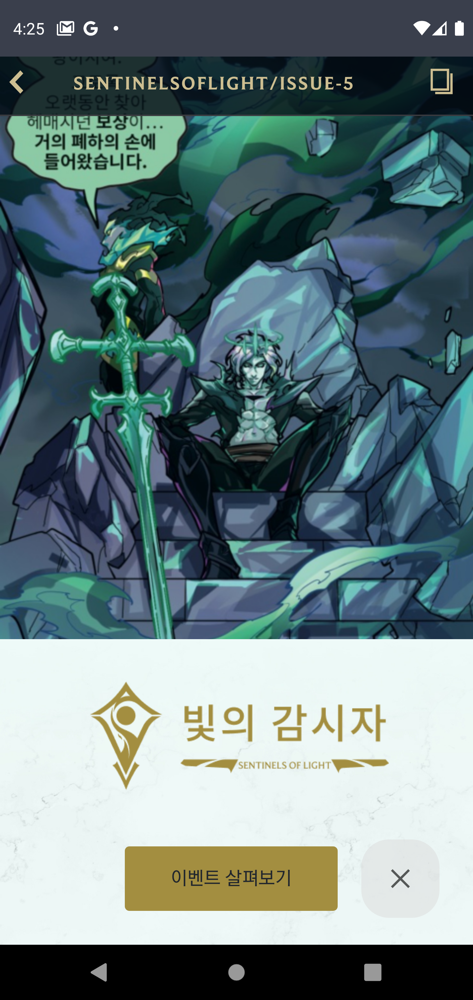

* #### ChampionFragment
* #### 라인별 챔피언 목록을 라인별로 볼 수 있습니다.
* #### You can view the list of champions by line.
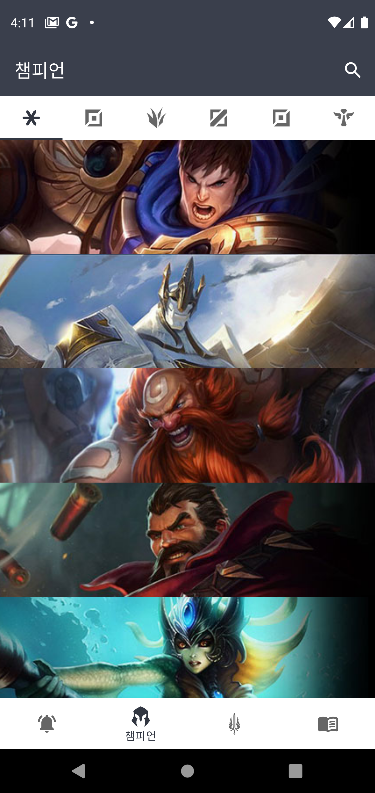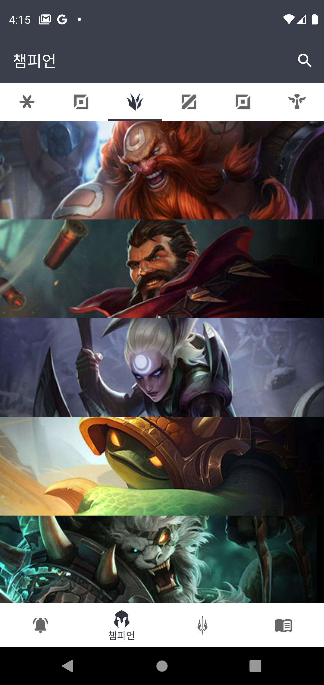

* #### ChampionInformationFragment
* #### 챔피언의 상세 정보를 볼 수 있습니다.
* #### You can view the champion's details.
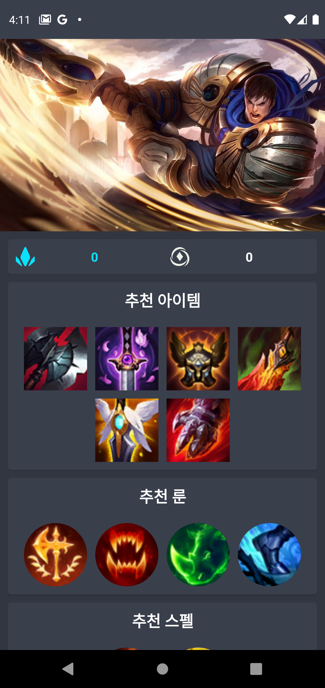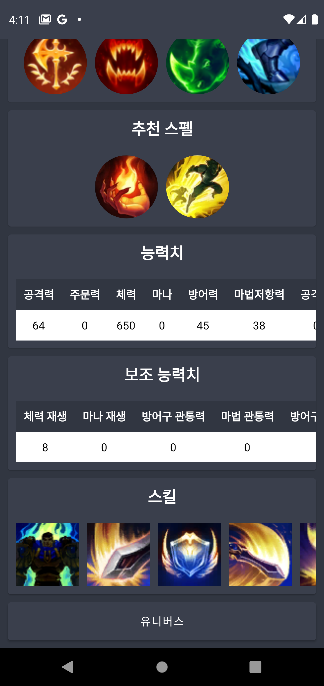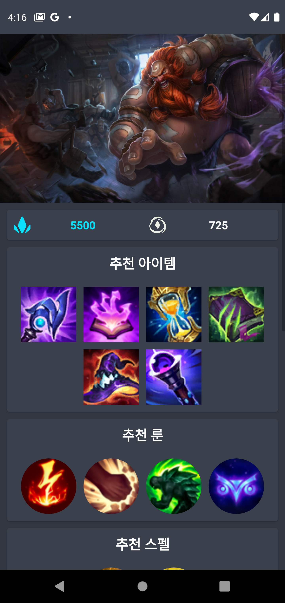

* #### ChampionSearchDialog
* #### 챔피언을 검색하여 찾을 수 있습니다.
* #### You can search for the champion and find them.
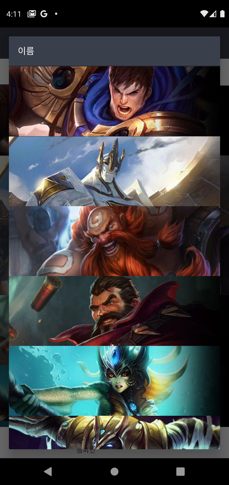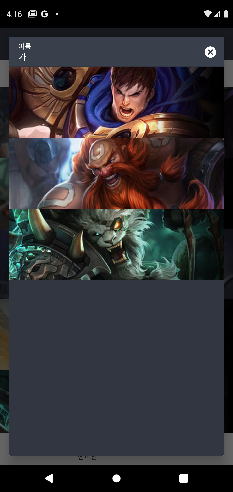

* #### ItemFragment
* #### 아이템 목록을 타입별로 볼 수 있습니다.
* #### You can see the list of items by type.
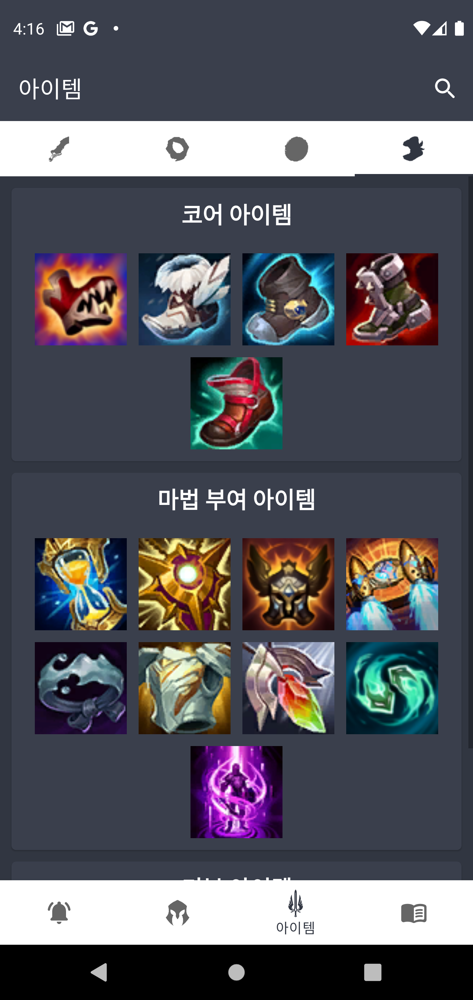

* #### ItemDialog
* #### 아이템 상세 정보를 볼 수 있습니다.
* #### You can see the item details.
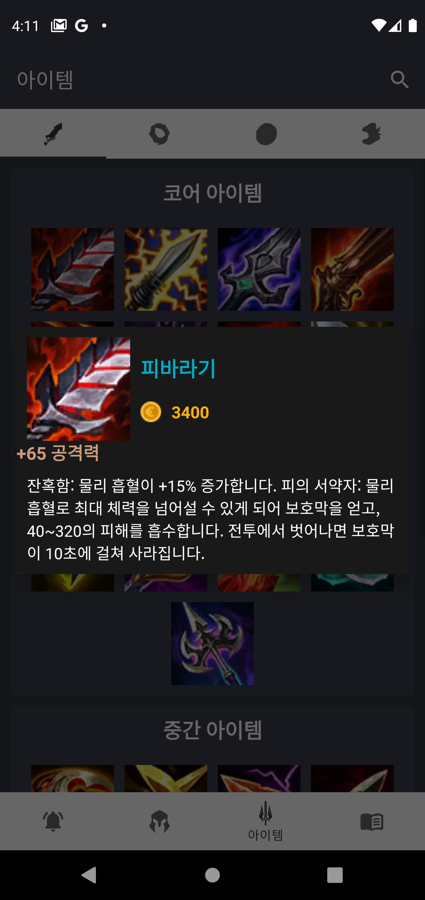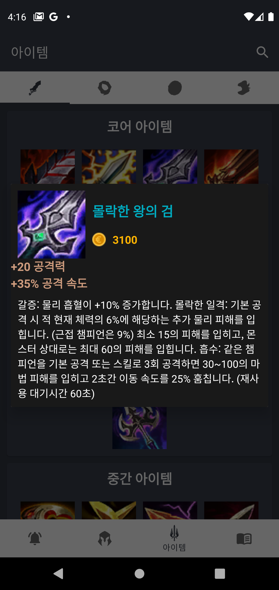

* #### ItemSearchDialog
* #### 아이템을 검색해서 찾을 수 있습니다.
* #### You can find the item by searching it.
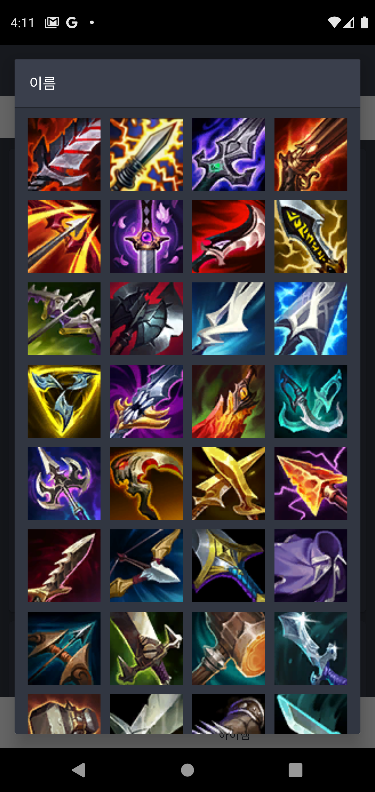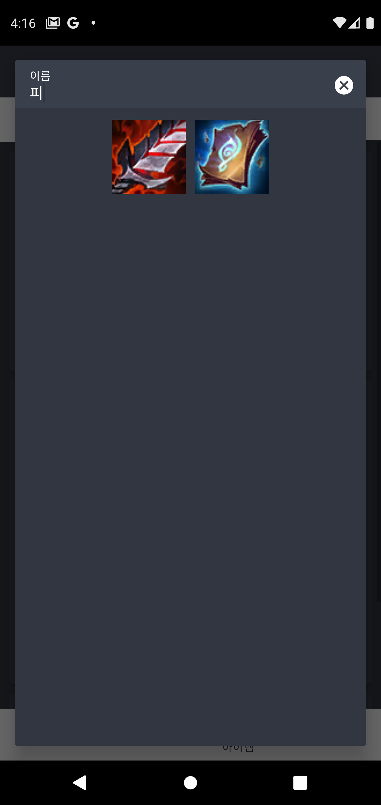

* #### RuneFragment
* #### 룬 목록을 볼 수 있습니다.
* #### You can view the list of runes.
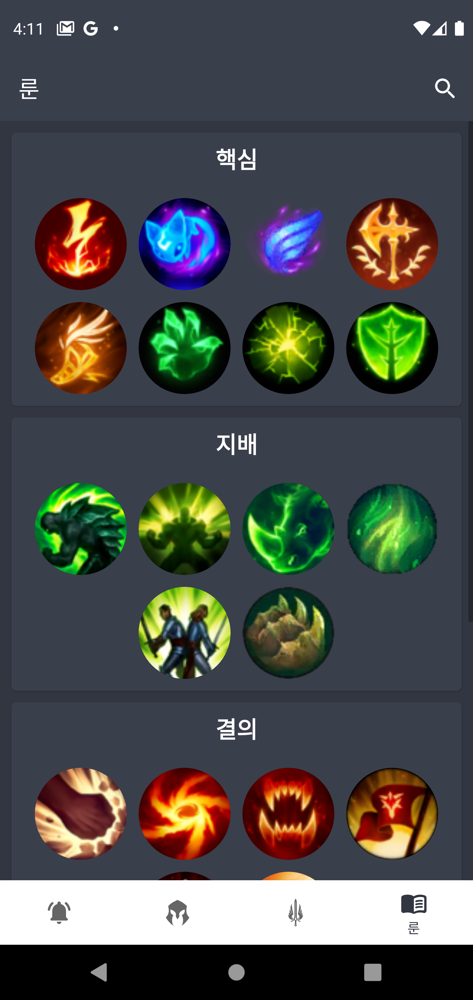

* #### RuneDialog
* #### 룬 상세 정보를 볼 수 있습니다.
* #### You can view the run details.
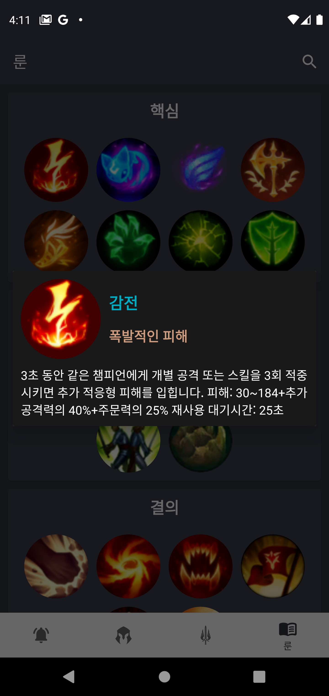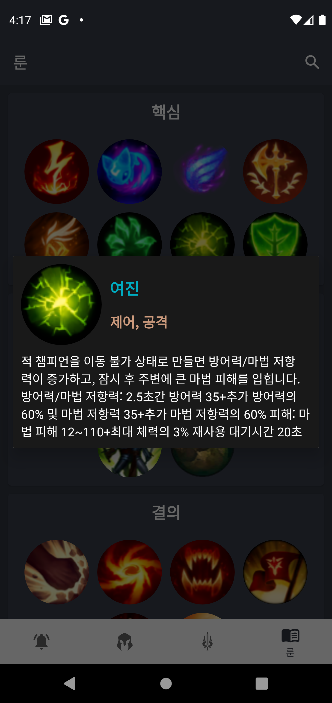

* #### RuneSearchDialog
* #### 룬을 검색해서 볼 수 있습니다.
* #### You can search and view the runes.
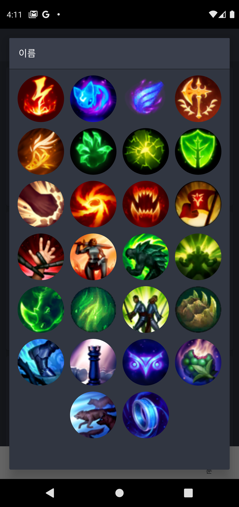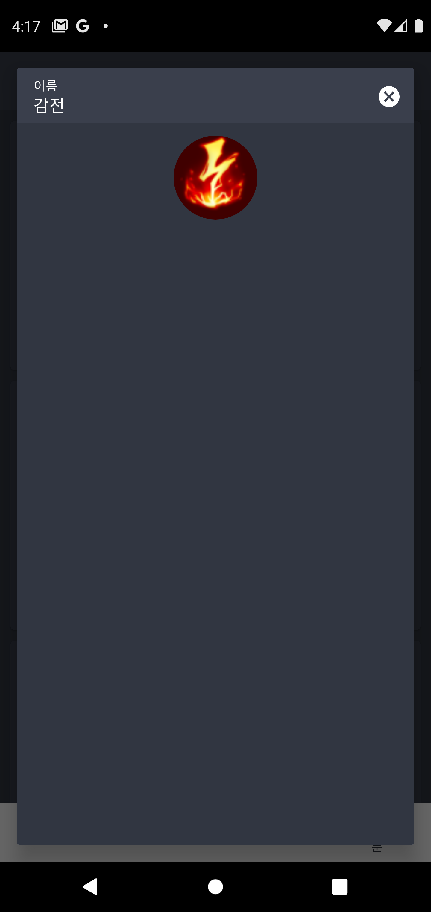

## ⚡ Features
* 공지사항 : 보건복지부에서 제공하는 데이터를 바탕으로 전국 코로나 감염 현황, 거리두기 현황 정보를 제공합니다.
* 챔피언 정보 : 보건복지부에서 제공하는 데이터를 바탕으로 전국 코로나 감염 현황, 거리두기 현황 정보를 제공합니다.
* 아이템 정보 : 보건복지부에서 제공하는 데이터를 바탕으로 연령별, 성별별 등 분석 데이터를 제공합니다.
* 룬 정보 : 한국어와 영어를 지원합니다.
* 위젯 지원 : 매일 업데이트 되는 위젯으로 정보를 놓치지 않고 받을 수 있습니다.
* 검색 기능 : 매일 업데이트 되는 위젯으로 정보를 놓치지 않고 받을 수 있습니다.
* 챔피언 유니버스 : 매일 업데이트 되는 위젯으로 정보를 놓치지 않고 받을 수 있습니다.

* Notice : Based on the data provided by the Ministry of Health and Welfare, information on the current status of coronavirus and the current status of distancing is provided.
* Champion Information : Based on the data provided by the Ministry of Health and Welfare, we provide information on the current status of corona infection and distancing.
* Item information : Based on the data provided by the Ministry of Health and Welfare, analysis data such as age and gender are provided.
* Run Information : Korean and English are supported.
* Widget support : Get information with widgets that are updated daily.
* Search capabilities : Get information with widgets that are updated daily.
* Champion Universe : Get information with the daily updates.
